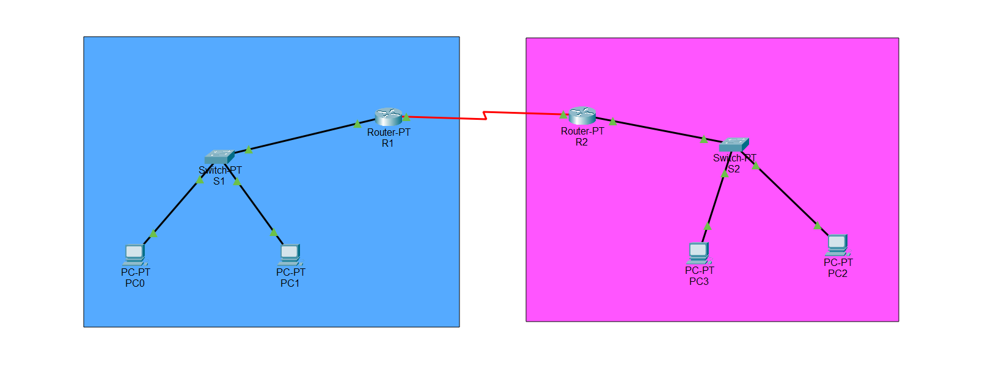
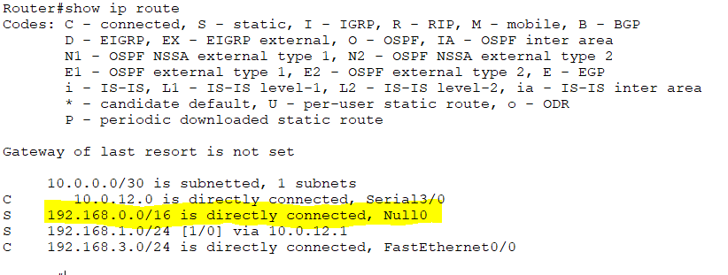
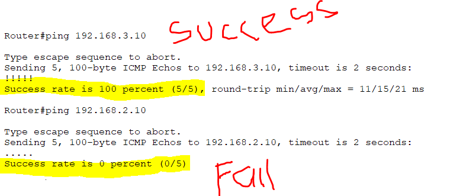

 # 🛠️ Static Blackhole Routing Lab (Cisco Routers)

## 📌 Objective
Connect two routers and their LANs using static routes, and configure a blackhole (Null0) route to discard traffic for unknown subnets within a summarized network range.
Verify that only valid networks are reachable, and unwanted subnets are dropped.

---

## 🌐 Network Topology
- **Routers:** R1, R2 
- **Switches:** One per router  
- **LANs:** PCs connected behind each router  
- **WAN Links:** Point-to-point connections using /30 subnets  

  
*(Replace with your diagram or Packet Tracer screenshot)*  

---

## 📊 IP Addressing Scheme

| Device | Interface | IP Address  | Subnet Mask     | Description |
| ------ | --------- | ----------- | --------------- | ----------- |
| R1     | Fast0/0   | 192.168.1.1 | 255.255.255.0   | LAN 1       |
| R1     | S0/0/0    | 10.0.12.1   | 255.255.255.252 | Link to R2  |
| R2     | Fast0/0   | 192.168.3.1 | 255.255.255.0   | LAN 2       |
| R2     | S0/0/0    | 10.0.12.2   | 255.255.255.252 | Link to R1  |

---

## ⚙️ Configuration Files
All router configs are saved in the [`configs/`](configs) folder:  
- [R1](configs/R1.txt)  
- [R2](configs/R2.txt)  

---

## ✅ Verification
1. **Check interfaces**

2. **Check routing tables**  

3. **Ping tests**  
 `R1# ping 192.168.3.10` → ✅ Success
- `R1# ping 192.168.2.10` → ❌ Fail (blackholed at R2) 

